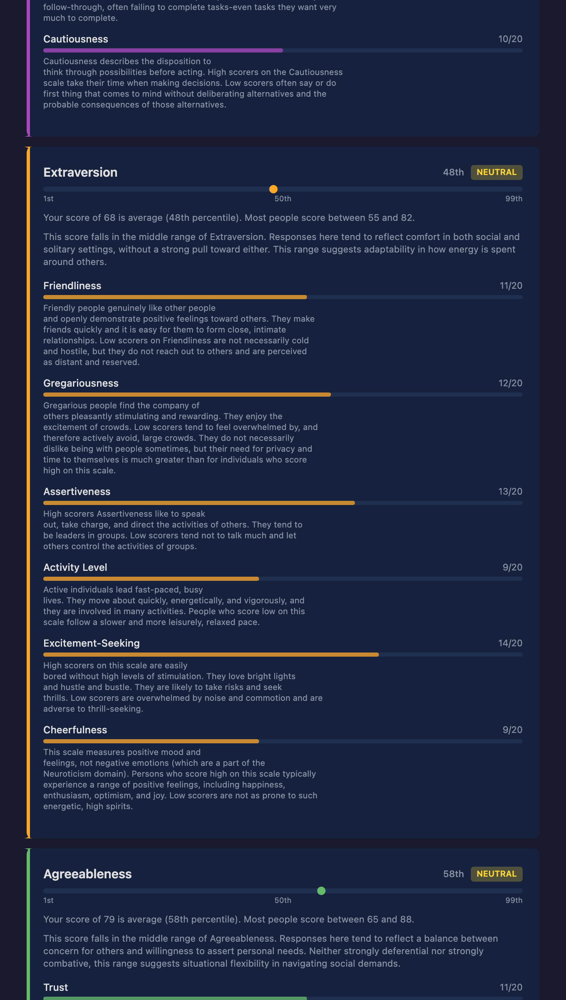

# Big Five Personality Test

This is a free, open-source Big Five personality test that runs entirely in your browser.

No accounts. No tracking. No servers. Your answers never leave your device.

## Why this exists

When you take a personality test online, you're sharing something personal. You're answering honestly about how you think, feel, and relate to other people. That takes trust.

Most sites don't earn that trust. Many don't disclose that they send your activity to tracking platforms like Google Analytics, Vercel Analytics, or similar services. They may not tell you up front that your browser fingerprint, IP address, and behavior are being recorded - often the moment your browser loads the web page. On their own, these details might not identify you. But when they're combined with data from advertising networks — Google Ads, for example — they can build up a surprisingly detailed picture of who you are and what you do online.

Your personality test results shouldn't be part of that picture. The best way to keep your results private is to use a pencil and paper to take the test. The next best way is to use a site that has nowhere to send the data to. This site is that site.

This project exists as a proof of concept. It shows that you can build the same test without any of the tracking. No data collection, no network connections after the initial page load, and full transparency about how it works.

## How it works

The test is 120 questions based on the [IPIP-NEO-PI-R](https://ipip.ori.org/), a well-established public domain personality inventory. It supports 42 languages.

Once the page loads in your browser, it works completely offline. The app saves a copy of itself so you can come back without an internet connection. Your answers are scored locally and stored only on your device, in your browser's local storage. Nothing is sent anywhere. If you are using a public computer or one where your browser history is shared, do not take the test using this tool.

When you finish, you get your results broken down by the five personality domains and their thirty facets.

<p align="center">
  
</p>

### Sharing results

If you want to share your results, the app gives you a link (or QR code). Here's what's important to understand: nothing is stored on a server. Your thirty facet summary scores are encoded directly into the link itself. When someone opens that link, their browser decodes the scores and displays them. That's it.

No individual answers to specific questions are included — just the summary facet scores. No personally identifiable information is shared. The link is the data.

You can also save your results as a PNG image. The exported image has all metadata stripped, so there's no hidden information embedded in the file.

The app's Privacy page explains all of this in more detail and walks you through how to verify it yourself.

## Use it

Open the site in any modern browser. That's it. No install, no sign-up. Once it loads, it's yours.

## Host it yourself

It's just static files. No server needed. You can put it anywhere.

1. Download this repository
2. Upload the `dist/` folder to any web host, or push to GitHub Pages
3. It works immediately

To rebuild from source, you'll need Node.js:

```
npm install
npm run build
```

The built site appears in `dist/`.

## Licenses

- **IPIP-NEO-PI-R items** — Public domain ([ipip.ori.org](https://ipip.ori.org/))
- **bigfive-web** — MIT License, B5 Holding AS ([license](https://github.com/rubynor/bigfive-web/blob/master/LICENSE))
- **QR Code generator** — MIT License, Project Nayuki ([source](https://www.nayuki.io/page/qr-code-generator-library))
- **This project** — MIT License, Stuffbucket

See [LICENSE](LICENSE) for full text.

## Disclaimer

This project is provided for educational and demonstration purposes only. It is a proof of concept showing how a more ethical approach to online personality testing can work. It is not intended to provide, and should not be relied upon for, medical, psychological, legal, or personal advice.

The personality assessment is based on publicly available research instruments and has not been independently validated for clinical or diagnostic use. If you have concerns about your mental health or well-being, please talk to a qualified healthcare professional or licensed psychologist.

THE SOFTWARE IS PROVIDED "AS IS", WITHOUT WARRANTY OF ANY KIND, EXPRESS OR IMPLIED. IN NO EVENT SHALL THE AUTHORS BE LIABLE FOR ANY CLAIM, DAMAGES, OR OTHER LIABILITY ARISING FROM THE USE OF THIS SOFTWARE. USE AT YOUR OWN RISK.
