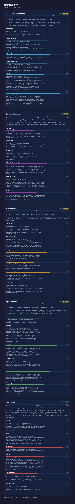

# What if a personality test actually respected the person taking it?

A person sits down to take a personality test. Maybe a therapist suggested it, maybe a school requires it, maybe they found it at two in the morning because sleep wasn't coming. They answer 120 questions. The result page says: *You are easily upset. You are not interested in other people's problems.* The language is direct, second-person, declarative — the grammar of diagnosis. It does not ask what country they are in, whether someone else uses this computer, or whether the trait it just named has a history they did not choose.

Most personality assessments treat the person taking them as a stable, context-free subject — someone with reliable privacy, a device of their own, and no particular reason to flinch at a blunt self-description. That is a design choice, even when it is made by not thinking about it at all.

This is a look at a different set of choices. An open-source Big Five personality test — a web application with no backend and no network requests — makes a series of decisions about language, privacy, scoring, and interface behavior that together amount to a different posture toward the person on the other side of the screen. The decisions are worth examining individually, because each one surfaces a question that most assessment tools skip — not because the question is obscure, but because skipping it is easier.

---

## The score is not the person

Here is what the standard text says when someone scores high on emotional reactivity:

> "Your score on Neuroticism is high, indicating that you are easily upset, even by what most people consider the normal demands of living. People consider you to be sensitive and emotional."

And here is the replacement:

> "This score falls in the upper range of Neuroticism. Responses in this area tend to reflect a heightened sensitivity to stress and a greater intensity of emotional experience. This can reflect many things — temperament, life circumstances, a nervous system that learned to stay alert, or some combination. A high score here is not a flaw. It is one description of a pattern, and it says nothing about why that pattern exists or what it has cost."

Read them side by side and three things shift.

The first is voice. The original says "you are easily upset." The revision describes a score range. It talks about what responses tend to reflect, not about who someone is.

The second is cause. The original assigns one: this is how you are. The revision names several possible origins — temperament, life circumstances, a nervous system shaped by experience — and declines to choose among them.

The third is ranking. The original arranges a hierarchy. "Most people" handle normal demands; you do not. The revision flattens the observation. A high score is a pattern. It is not a rank.

These are not tone edits. They address something a personality questionnaire fundamentally cannot do: tell the difference between a trait someone was born with and an adaptation they developed to survive. Two people can answer the same questions identically and arrive at the same score for entirely different reasons. One person's emotional reactivity is temperament. Another's is a response to an environment that was genuinely unsafe — a nervous system that learned to stay alert and never fully stood down. The score cannot tell these apart. It was never designed to.

The original text collapses that ambiguity. It takes a measurement and makes an identity claim. For someone whose heightened reactivity is an adaptation — who already struggles against the belief that they are too sensitive, too much — being told by an authoritative instrument that they are "easily upset by what most people consider normal" confirms the very thing they may already hold against themselves.

The same care runs across all five traits and all three score levels. For low agreeableness, the revision notes that directness "may reflect a different way of showing" care. For low conscientiousness, it acknowledges "circumstances where sustained planning has been difficult." Even low emotional reactivity — the supposedly good end of the scale — gets the same treatment: calm "can also reflect emotional distance or learned suppression." No score is permitted to close the interpretive question.

This extends well beyond personality testing. Any time a system translates a number into a sentence about a person — a performance review, a health risk estimate, a credit assessment, a learning dashboard — it faces the same decision: does the language acknowledge the gap between what was measured and what it means, or does it write as though the gap does not exist?

---

## The app cannot phone home

Most web applications can send data back to a server at any time — that is how the web normally works. This one cannot. A security rule baked into the page tells the browser to block every outbound request the application attempts after it first loads. Not some requests. All of them. It is not a setting that can be toggled or a policy that can be revised. The browser itself enforces it the way a locked door enforces a boundary.

There are no cookies. There is no tracking. There are no external scripts. When someone shares their results, the scores travel inside the link itself — the receiving end reconstructs the results from the address, and no server is involved. When someone exports their results as an image, a function strips everything from the file except the visible picture — no hidden data, no embedded metadata.

The privacy page does not just describe these properties. It tests them live, in real time, while the person watches. No cookies found. No external scripts loaded. Outbound connections blocked. The claims are not a matter of trust. They are a matter of demonstration.

This matters more than usual for a personality test. The answers touch on emotional stability, social tendencies, how someone responds to stress — the contours of where a person is open and where they are guarded. The standard approach to this kind of data is to collect it, write a privacy policy about the collection, and decide later what to do with it. A privacy policy describes what an organization intends. It can be revised. It can be contradicted by a script someone added without thinking. It is a promise.

This application takes a different position: the data never leaves the device. Not as a promise. As a fact the architecture enforces.

Most applications need servers, need to send and receive data — they cannot block all outbound requests. But the underlying design move is portable. Whatever an application claims about privacy can be made verifiable — something the person using it can see confirmed, not something they are asked to take on faith.

---

## The app knows it's on a shared computer

Two small prompts do most of the work. The first appears whenever stored answers already exist in the browser: *This app has in-progress answers from a previous visit. Would you like to keep that data or clear it?* The second appears once, the first time someone starts the test: *Your answers are saved in this browser. Is anyone else able to use it?* If they say yes, they're taken to a page where they can delete everything. If they say no, the prompt goes away.

No device detection, no login wall. Just a question in plain language.

The people most likely to see that question on a shared device are the people who need it most. A teenager taking the test on a school laptop. Someone at a public library. A person in a shelter, on a phone that isn't theirs. These are not unusual circumstances. They are the ordinary conditions of millions of people's digital lives — people who do not own the hardware, do not control the browser history, and cannot guarantee that the next person to sit down won't see what they left behind.

A personality test stores answers about emotional patterns, social tendencies, how someone handles stress. That data, left behind in a browser on a shared machine, is not a technical inconvenience. It is an exposure. And the people most likely to be exposed — people with less privacy, less stability, less control over their own devices — are often the people whose life experiences show up most visibly in the results.

Most applications that store sensitive data in the browser never consider this. The ones that do tend to treat it as a technical problem — automatic timeouts, expiring sessions. This project treats it as a question about dignity. The prompt does not explain threat models. It asks a human question and offers a clear way out.

The entire check is about fifteen lines of code. The barrier to building it was never technical. It was attentional.

---

## Where "high" means something

Most personality tests decide whether a score is "high" or "low" by splitting the scale down the middle. If the possible range is 24 to 120, anything above 72 is called high. This sounds reasonable. It is not.

Consider agreeableness — the trait that measures warmth, cooperativeness, and concern for others. Most people score relatively high on this dimension. The average is around 77. Under middle-of-the-scale scoring, a person who scores 74 — slightly below that average — gets classified as "high." The interface tells them they are more agreeable than most people. The opposite is true.

The distortion runs in different directions on different traits. On emotional reactivity, the average is around 60 — well below the midpoint of 72. Here the system is too conservative. A person has to score far above average before the tool calls them "high." A single cutoff, applied uniformly across traits that distribute differently, is sensitive to nothing except the arithmetic of the scale itself.

This project measures each trait against how people actually score. A result is "high" when it falls meaningfully above the population, "low" when it falls meaningfully below, and the middle range is acknowledged as the middle range. The classification tracks where a person sits relative to other people, not relative to an arbitrary line on a ruler.

Sample results page (click to expand)

  

Getting this right matters because the label is not the end of the process — it is the beginning. The label selects the description. A person classified as "highly agreeable" reads a passage about tendencies toward trust and deference. When the label is wrong, the description is wrong, and the person receives a confident account of someone they are not. For a tool that has been redesigned at every other level to avoid making false claims about people, an inaccurate classification undoes the work.

The honesty extends to acknowledging limits. Population-level data exists for the five broad traits but not for the thirty finer-grained sub-traits beneath them. For those, the tool falls back to the simpler midpoint method — and says so. The principle: use the best available reference at each level of detail, and be transparent about where precision drops. A visual display shows each score as a point on a range, giving spatial intuition that no label, however accurate, can communicate alone.

---

## Forty-two languages, one set of principles

The test runs in forty-two languages. Thirty-eight of them carry rewritten result descriptions — text that is careful about what a score is and what it is not. Each language follows the same structure: an opening line ("No set of numbers can contain a person"), a disclaimer separating scores from identity, and revised descriptions for all five traits at all three score levels. The consistency across languages is the point.

Standard localization treats this as a word-replacement problem. Hand the text to a translator, get back equivalent sentences, ship the update. For button labels and menu items, that works. For a sentence like "a nervous system that learned to stay alert," it does not — not because of grammar, but because the reader's relationship to that idea is different depending on where and how they live. Emotional restraint carries one meaning in a culture that values composure and another where it signals something survived. The social weight of agreeableness shifts across contexts. What "learned to stay alert" implies about a person's history depends on which history the reader is most likely to carry.

The project addresses this by documenting the principles at the top of the translation file, aimed at translators rather than engineers. The guidance says, in effect: here is what this text is trying to do. Third person. Multiple possible origins. No identity claims. Make the judgment calls your language requires.

The unit of translation is the principle, not the sentence.

Most translation workflows optimize for literal accuracy and speed, and most quality checks ask whether the translated text says the same words. But literal accuracy and emotional accuracy are not the same thing. The better question is whether the translated text does the same work as the source — whether it holds open the same space between a score and a self. Answering that question means giving translators context and authority, not just strings and deadlines.

---

A thread runs through these five decisions, and it is not sophistication. Third-person language is known in clinical writing. Applications that work without a network connection are a solved problem. Measuring a score against how people actually perform is standard practice. Asking a question before proceeding is as old as dialog boxes. Thoughtful translation practices have been articulated by people doing harder work than building web applications. None of this is new. What is unusual is applying all of it, together, to the same tool, for the same reason: because the person most likely to be affected by a careless default is the one whose experience should inform the design.

Design encodes assumptions about the people it touches. A personality test that speaks in the voice of authority, stores data it did not ask to keep, scores against an arbitrary line, and ships in one language has made choices about who it is for. Unintended assumptions may have been made without conciously making a choice. This does not make the design neutral, the choices are just invisible to the designer.

Every design carries a posture toward the person using it. The question is whether you arrive at yours on purpose or by accident.
